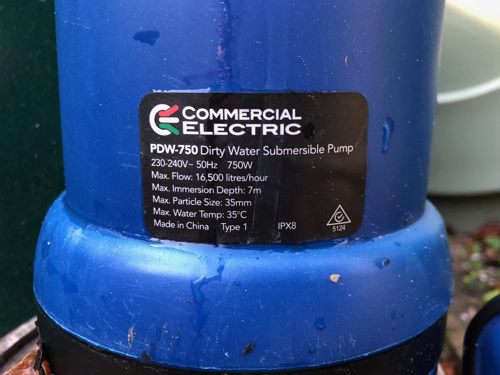
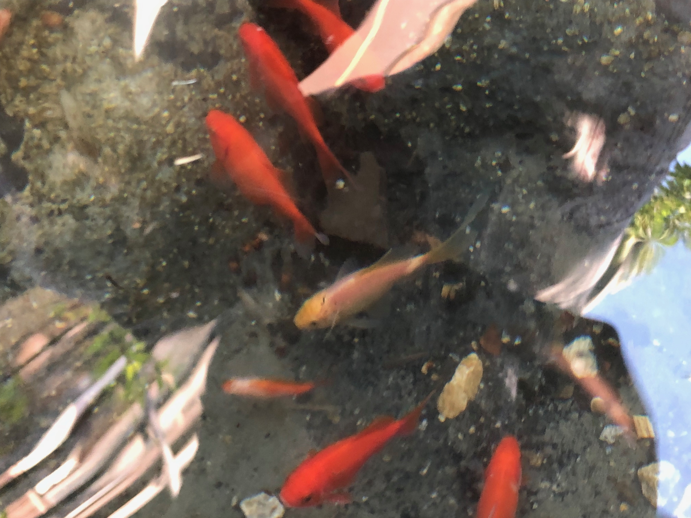
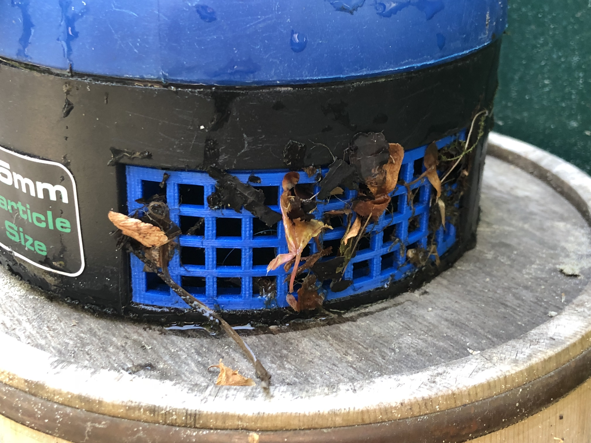

# Pump Filter

This repository contains a part which can be used as a filter on a pump. The pump I have is a "Commercial Electric" PDW-750 Dirty Water Submersible Pump.

## Motivation

Once a year I empty my pond and I'm often concerned about fish getting sucked through the pump. In the past, unfortunately, it's happened, even when using a bucket, wire mesh and various other makeshift filters. Finally, I decided to 3D print a filter bracket that could fit directly in the pump.

## Instructions

1. Print 3x the parts as required.
2. They pressure fit into the pumps inlets around the bottom.
3. When using the pump, ensure the filters don't get blocked completely otherwise the pump will overheat.

## Contributing

1. Fork it
2. Create your feature branch (`git checkout -b my-new-feature`)
3. Commit your changes (`git commit -am 'Add some feature'`)
4. Push to the branch (`git push origin my-new-feature`)
5. Create new Pull Request

## License

Released under the MIT license.

Copyright, 2018, by [Samuel G. D. Williams](http://www.codeotaku.com/samuel-williams).

Permission is hereby granted, free of charge, to any person obtaining a copy of this software and associated documentation files (the "Software"), to deal in the Software without restriction, including without limitation the rights to use, copy, modify, merge, publish, distribute, sublicense, and/or sell copies of the Software, and to permit persons to whom the Software is furnished to do so, subject to the following conditions:

The above copyright notice and this permission notice shall be included in all copies or substantial portions of the Software.

THE SOFTWARE IS PROVIDED "AS IS", WITHOUT WARRANTY OF ANY KIND, EXPRESS OR IMPLIED, INCLUDING BUT NOT LIMITED TO THE WARRANTIES OF MERCHANTABILITY, FITNESS FOR A PARTICULAR PURPOSE AND NONINFRINGEMENT. IN NO EVENT SHALL THE AUTHORS OR COPYRIGHT HOLDERS BE LIABLE FOR ANY CLAIM, DAMAGES OR OTHER LIABILITY, WHETHER IN AN ACTION OF CONTRACT, TORT OR OTHERWISE, ARISING FROM, OUT OF OR IN CONNECTION WITH THE SOFTWARE OR THE USE OR OTHER DEALINGS IN THE SOFTWARE.
